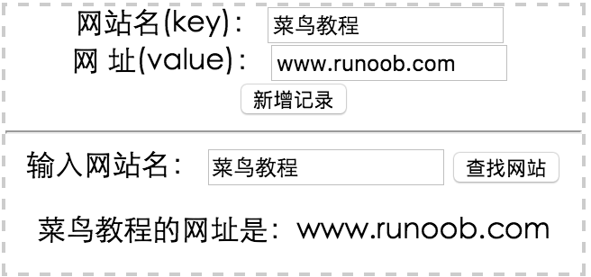

# HTML5 Web 存储

--------

HTML5 web 存储,一个比cookie更好的本地存储方式。

--------

## 什么是 HTML5 Web 存储?

使用HTML5可以在本地存储用户的浏览数据。

早些时候,本地存储使用的是 cookie。但是Web 存储需要更加的安全与快速. 这些数据不会被保存在服务器上，但是这些数据只用于用户请求网站数据上.它也可以存储大量的数据，而不影响网站的性能.

数据以 键/值 对存在, web网页的数据只允许该网页访问使用。

--------

## 浏览器支持


Internet Explorer 8+, Firefox, Opera, Chrome, 和 Safari支持Web 存储。

**注意:**  Internet Explorer 7 及更早IE版本不支持web 存储.

--------

## localStorage 和 sessionStorage

客户端存储数据的两个对象为：

 * localStorage - 没有时间限制的数据存储
 * sessionStorage - 针对一个 session 的数据存储在使用 web 存储前,应检查浏览器是否支持 localStorage 和sessionStorage:

```JavaScript
if(typeof(Storage)!=="undefined")
{
    // 是的! 支持 localStorage sessionStorage 对象!
    // 一些代码.....
} else {
    // 抱歉! 不支持 web 存储。
}
```

--------

## localStorage 对象

localStorage 对象存储的数据没有时间限制。第二天、第二周或下一年之后，数据依然可用。

## 实例

```JavaScript
localStorage.sitename="菜鸟教程";
document.getElementById("result").innerHTML="网站名：" + localStorage.sitename;
```

[尝试一下 »](http://www.runoob.com/try/try.php?filename=tryhtml5_webstorage_local)

实例解析：

 * 使用 key="sitename" 和 value="菜鸟教程" 创建一个 localStorage 键/值对。
 * 检索键值为"sitename" 的值然后将数据插入 id="result"的元素中。以上实例也可以这么写：

```JavaScript
// 存储
localStorage.sitename = "菜鸟教程";
// 查找
document.getElementById("result").innerHTML = localStorage.sitename;
```

移除 localStorage 中的 "lastname" :

```JavaScript
localStorage.removeItem("lastname");
```

不管是 localStorage，还是 sessionStorage，可使用的API都相同，常用的有如下几个（以localStorage为例）：

 * 保存数据：localStorage.setItem(key,value);
 * 读取数据：localStorage.getItem(key);
 * 删除单个数据：localStorage.removeItem(key);
 * 删除所有数据：localStorage.clear();
 * 得到某个索引的key：localStorage.key(index);**提示:**  键/值对通常以字符串存储，你可以按自己的需要转换该格式。

下面的实例展示了用户点击按钮的次数。

代码中的字符串值转换为数字类型:

## 实例

```JavaScript
if (localStorage.clickcount)
{
    localStorage.clickcount=Number(localStorage.clickcount)+1;
}
else
{
    localStorage.clickcount=1;
}
document.getElementById("result").innerHTML=" 你已经点击了按钮 " + localStorage.clickcount + " 次 ";
```

[尝试一下 »](http://www.runoob.com/try/try.php?filename=tryhtml5_webstorage_local_clickcount)

--------

## sessionStorage 对象

sessionStorage 方法针对一个 session 进行数据存储。当用户关闭浏览器窗口后，数据会被删除。

如何创建并访问一个 sessionStorage：:

## 实例

```JavaScript
if (sessionStorage.clickcount)
{
    sessionStorage.clickcount=Number(sessionStorage.clickcount)+1;
}
else
{
    sessionStorage.clickcount=1;
}
document.getElementById("result").innerHTML="在这个会话中你已经点击了该按钮 " + sessionStorage.clickcount + " 次 ";
```

[尝试一下 »](http://www.runoob.com/try/try.php?filename=tryhtml5_webstorage_session)

--------

## Web Storage 开发一个简单的网站列表程序

网站列表程序实现以下功能：

 * 可以输入网站名，网址，以网站名作为key存入localStorage；
 * 根据网站名，查找网址；
 * 列出当前已保存的所有网站；以下代码用于保存于查找数据：

## save() 与 find() 方法

```JavaScript
//保存数据 
function save(){
    var siteurl = document.getElementById("siteurl").value;
    var sitename = document.getElementById("sitename").value;
    localStorage.setItem(sitename, siteurl);
    alert("添加成功");
}
//查找数据 
function find(){
    var search_site = document.getElementById("search_site").value;
    var sitename = localStorage.getItem(search_site);
    var find_result = document.getElementById("find_result");
    find_result.innerHTML = search_site + "的网址是：" + sitename;
}
```

完整实例演示如下：

## 实例

```HTML
<div style="border: 2px dashed #ccc;width:320px;text-align:center;">
    <label for="sitename">网站名(key)：</label>
    <input type="text" id="sitename" name="sitename" class="text"/>
    <br/>
    <label for="siteurl">网 址(value)：</label>
    <input type="text" id="siteurl" name="siteurl"/>
    <br/>
    <input type="button" onclick="save()" value="新增记录"/>
    <hr/>
    <label for="search_phone">输入网站名：</label>
    <input type="text" id="search_site" name="search_site"/>
    <input type="button" onclick="find()" value="查找网站"/>
    <p id="find_result"><br/></p>
</div>
```

[尝试一下 »](http://www.runoob.com/try/try.php?filename=tryhtml5_webstorage_demo)

实现效果截图：



以上实例只是演示了简单的 localStorage 存储与查找，更多情况下我们存储的数据会更复杂。

接下来我们将使用 [JSON.stringify](http://www.runoob.com/js/javascript-json-stringify.html) 来存储对象数据，[JSON.stringify](http://www.runoob.com/js/javascript-json-stringify.html) 可以将对象转换为字符串。

```JavaScript
var site = new Object;
...
var str = JSON.stringify(site); // 将对象转换为字符串
```

之后我们使用 [JSON.parse](http://www.runoob.com/js/javascript-json-parse.html) 方法将字符串转换为 JSON 对象：

```JavaScript
var site = JSON.parse(str);
```

JavaScript 实现代码：

## save() 与 find() 方法

```JavaScript
//保存数据 
function save(){
    var site = new Object;
    site.keyname = document.getElementById("keyname").value;
    site.sitename = document.getElementById("sitename").value;
    site.siteurl = document.getElementById("siteurl").value;
    var str = JSON.stringify(site); // 将对象转换为字符串
    localStorage.setItem(site.keyname,str);
    alert("保存成功");
}
//查找数据 
function find(){
    var search_site = document.getElementById("search_site").value;
    var str = localStorage.getItem(search_site);
    var find_result = document.getElementById("find_result");
    var site = JSON.parse(str);
    find_result.innerHTML = search_site + "的网站名是：" + site.sitename + "，网址是：" + site.siteurl;
}
```

完整实例如下：

## 实例

```HTML
<div style="border: 2px dashed #ccc;width:320px;text-align:center;">
    <label for="keyname">别名(key):</label>
    <input type="text" id="keyname" name="keyname" class="text"/>
    <br/>
    <label for="sitename">网站名：</label>
    <input type="text" id="sitename" name="sitename" class="text"/>
    <br/>
    <label for="siteurl">网 址：</label>
    <input type="text" id="siteurl" name="siteurl"/>
    <br/>
    <input type="button" onclick="save()" value="新增记录"/>
    <hr/>
    <label for="search_phone">输入别名(key)：</label>
    <input type="text" id="search_site" name="search_site"/>
    <input type="button" onclick="find()" value="查找网站"/>
    <p id="find_result"><br/></p>
</div>
```

[尝试一下 »](http://www.runoob.com/try/try.php?filename=tryhtml5_webstorage_demo2)

实例中的 loadAll 输出了所有存储的数据，你需要确保 localStorage 存储的数据都为 JSON 格式，否则 JSON.parse(str) 将会报错。

输出结果演示：


