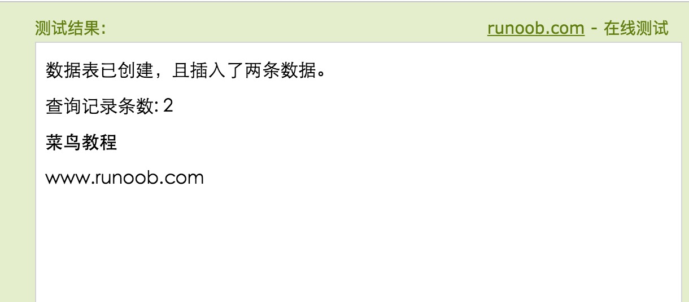

# HTML5 Web SQL 数据库

Web SQL 数据库 API 并不是 HTML5 规范的一部分，但是它是一个独立的规范，引入了一组使用 SQL 操作客户端数据库的 APIs。

如果你是一个 Web 后端程序员，应该很容易理解 SQL 的操作。

你也可以参考我们的 [SQL 教程](http://www.runoob.com/sql/sql-tutorial.html)，了解更多数据库操作知识。

Web SQL 数据库可以在最新版的 Safari, Chrome 和 Opera 浏览器中工作。

--------

## 核心方法

以下是规范中定义的三个核心方法：

2. **openDatabase** ：这个方法使用现有的数据库或者新建的数据库创建一个数据库对象。

4. **transaction** ：这个方法让我们能够控制一个事务，以及基于这种情况执行提交或者回滚。

6. **executeSql** ：这个方法用于执行实际的 SQL 查询。

--------

## 打开数据库

我们可以使用 openDatabase() 方法来打开已存在的数据库，如果数据库不存在，则会创建一个新的数据库，使用代码如下：

```JavaScript
var db = openDatabase('mydb', '1.0', 'Test DB', 2 * 1024 * 1024);
```

openDatabase() 方法对应的五个参数说明：

1. 数据库名称
2. 版本号
3. 描述文本
4. 数据库大小
5. 创建回调第五个参数，创建回调会在创建数据库后被调用。

--------

## 执行查询操作

执行操作使用 database.transaction() 函数：

```JavaScript
var db = openDatabase('mydb', '1.0', 'Test DB', 2 * 1024 * 1024);
db.transaction(function (tx) {  
   tx.executeSql('CREATE TABLE IF NOT EXISTS LOGS (id unique, log)');
});
```

上面的语句执行后会在 'mydb' 数据库中创建一个名为 LOGS 的表。

--------

## 插入数据

在执行上面的创建表语句后，我们可以插入一些数据：

```JavaScript
var db = openDatabase('mydb', '1.0', 'Test DB', 2 * 1024 * 1024);
db.transaction(function (tx) {
   tx.executeSql('CREATE TABLE IF NOT EXISTS LOGS (id unique, log)');
   tx.executeSql('INSERT INTO LOGS (id, log) VALUES (1, "菜鸟教程")');
   tx.executeSql('INSERT INTO LOGS (id, log) VALUES (2, "www.runoob.com")');
});
```

我们也可以使用动态值来插入数据：

```JavaScript
var db = openDatabase('mydb', '1.0', 'Test DB', 2 * 1024 * 1024);
db.transaction(function (tx) {  
  tx.executeSql('CREATE TABLE IF NOT EXISTS LOGS (id unique, log)');
  tx.executeSql('INSERT INTO LOGS 
                        (id,log) VALUES (?, ?'), [e_id, e_log];
});
```

实例中的 e_id 和 e_log 是外部变量，executeSql 会映射数组参数中的每个条目给 "?"。

--------

## 读取数据

以下实例演示了如何读取数据库中已经存在的数据：

```JavaScript
var db = openDatabase('mydb', '1.0', 'Test DB', 2 * 1024 * 1024);

db.transaction(function (tx) {
   tx.executeSql('CREATE TABLE IF NOT EXISTS LOGS (id unique, log)');
   tx.executeSql('INSERT INTO LOGS (id, log) VALUES (1, "菜鸟教程")');
   tx.executeSql('INSERT INTO LOGS (id, log) VALUES (2, "www.runoob.com")');
});

db.transaction(function (tx) {
   tx.executeSql('SELECT * FROM LOGS', [], function (tx, results) {
      var len = results.rows.length, i;
      msg = "<p>查询记录条数: " + len + "</p>";
      document.querySelector('#status').innerHTML +=  msg;
	
      for (i = 0; i < len; i++){
         alert(results.rows.item(i).log );
      }
	
   }, null);
});
```

--------

## 完整实例

```HTML
<!DOCTYPE HTML>
<html>

   <head>
	
      <script type="text/javascript">
		
         var db = openDatabase('mydb', '1.0', 'Test DB', 2 * 1024 * 1024);
         var msg;
			
         db.transaction(function (tx) {
            tx.executeSql('CREATE TABLE IF NOT EXISTS LOGS (id unique, log)');
            tx.executeSql('INSERT INTO LOGS (id, log) VALUES (1, "菜鸟教程")');
            tx.executeSql('INSERT INTO LOGS (id, log) VALUES (2, "www.runoob.com")');
            msg = '<p>数据表已创建，且插入了两条数据。</p>';
            document.querySelector('#status').innerHTML =  msg;
         });

         db.transaction(function (tx) {
            tx.executeSql('SELECT * FROM LOGS', [], function (tx, results) {
               var len = results.rows.length, i;
               msg = "<p>查询记录条数: " + len + "</p>";
               document.querySelector('#status').innerHTML +=  msg;
					
               for (i = 0; i < len; i++){
                  msg = "<p><b>" + results.rows.item(i).log + "</b></p>";
                  document.querySelector('#status').innerHTML +=  msg;
               }
            }, null);
         });
			
      </script>
		
   </head>
	
   <body>
      <div id="status" name="status">状态信息</div>
   </body>
	
</html>
```

[尝试一下 »](http://www.runoob.com/try/try.php?filename=tryhtml5_websql)

以上实例运行结果如下图所示：



--------

## 删除记录

删除记录使用的格式如下：

```JavaScript
db.transaction(function (tx) {
    tx.executeSql('DELETE FROM LOGS  WHERE id=1');
});
```

删除指定的数据id也可以是动态的：

```JavaScript
db.transaction(function(tx) {
    tx.executeSql('DELETE FROM LOGS WHERE id=?', [id]);
});
```

--------

## 更新记录

更新记录使用的格式如下：

```JavaScript
db.transaction(function (tx) {
    tx.executeSql('UPDATE LOGS SET log=\'www.w3cschool.cc\' WHERE id=2');
});
```

更新指定的数据id也可以是动态的：

```JavaScript
db.transaction(function(tx) {
    tx.executeSql('UPDATE LOGS SET log=\'www.w3cschool.cc\' WHERE id=?', [id]);
});
```

--------

## 完整实例

```HTML
<!DOCTYPE HTML>
<html>
   <head>
      <meta charset="UTF-8">  
      <script type="text/javascript">
      
         var db = openDatabase('mydb', '1.0', 'Test DB', 2 * 1024 * 1024);
         var msg;
         
         db.transaction(function (tx) {
            tx.executeSql('CREATE TABLE IF NOT EXISTS LOGS (id unique, log)');
            tx.executeSql('INSERT INTO LOGS (id, log) VALUES (1, "菜鸟教程")');
            tx.executeSql('INSERT INTO LOGS (id, log) VALUES (2, "www.runoob.com")');
            msg = '<p>数据表已创建，且插入了两条数据。</p>';
            document.querySelector('#status').innerHTML =  msg;
         });

         db.transaction(function (tx) {
              tx.executeSql('DELETE FROM LOGS  WHERE id=1');
              msg = '<p>删除 id 为 1 的记录。</p>';
              document.querySelector('#status').innerHTML =  msg;
         });

         db.transaction(function (tx) {
             tx.executeSql('UPDATE LOGS SET log=\'www.w3cschool.cc\' WHERE id=2');
              msg = '<p>更新 id 为 2 的记录。</p>';
              document.querySelector('#status').innerHTML =  msg;
         });

         db.transaction(function (tx) {
            tx.executeSql('SELECT * FROM LOGS', [], function (tx, results) {
               var len = results.rows.length, i;
               msg = "<p>查询记录条数: " + len + "</p>";
               document.querySelector('#status').innerHTML +=  msg;
               
               for (i = 0; i < len; i++){
                  msg = "<p><b>" + results.rows.item(i).log + "</b></p>";
                  document.querySelector('#status').innerHTML +=  msg;
               }
            }, null);
         });
         
      </script>
      
   </head>
   
   <body>
      <div id="status" name="status">状态信息</div>
   </body>
   
</html>
```

[尝试一下 »](http://www.runoob.com/try/try.php?filename=tryhtml5_websql2)

以上实例运行结果如下图所示：


